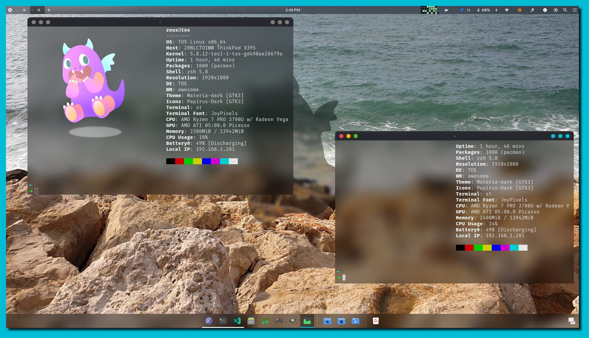

[![Build Status repo][repo-build]][repo-url]
[![Contributors][contributors-shield]][contributors-url]
[![Forks][forks-shield]][forks-url] [![Stargazers][stars-shield]][stars-url]
[![Issues][issues-shield]][issues-url]
[![GPL License][license-shield]][license-url]

<!-- PROJECT LOGO -->
<br />
<p align="center">
  <a href="https://github.com/ODEX-TOS/tos-desktop-environment">
    
  </a>

  <h3 align="center">TOS-Live</h3>

  <p align="center">
    This repo contains the build for TOS (Tom OS live iso)
    <br />
    <a href="https://tos.odex.be/docs/"><strong>Explore the docs »</strong></a>
    <br />
    <br />
    <a href="https://wiki.odex.be">View wiki</a>
    ·
    <a href="https://github.com/ODEX-TOS/tos-desktop-environment/issues">Report Bug</a>
    ·
    <a href="https://github.com/ODEX-TOS/tos-desktop-environment/issues">Request Feature</a>
  </p>
</p>

<!-- TABLE OF CONTENTS -->

## Table of Contents

- [About the Project](#about-the-project)
  - [Built With](#built-with)
- [Getting Started](#getting-started)
  - [Prerequisites](#prerequisites)
  - [Installation](#installation)
- [Usage](#usage)
  - [Unit Testing](#unit-test)
    - [Dockerized](#docker)
- [Roadmap](#roadmap)
- [Contributing](#contributing)
- [License](#license)
- [Contact](#contact)
- [Acknowledgements](#acknowledgements)

<!-- ABOUT THE PROJECT -->

## About The Project

### Built By

- [F0xedb](https://www.odex.be)

<!-- GETTING STARTED -->

## Getting Started

To get a local copy up and running follow these simple steps.

### Prerequisites

> TDE depends on a lot of different tools and projects. A list can be found
> [here](https://github.com/ODEX-TOS/tos-live/blob/master/repo/BUILD/PKGBUILD_AWESOME)



### Installation

1. Install awesomewm

```sh
sudo pacman -Syu awesomewm
```

2. Clone the repo

```sh
git clone https://github.com/ODEX-TOS/tos-desktop-environment.git
```

3. Set the required files in the appropriate locations

```sh
sudo mkdir -p /etc/xdg/awesome
sudo cp -r tos-desktop-environment/tde/* /etc/xdg/awesome
```

4. Use wm-debug for easier development

```sh
git clone https://github.com:ODEX-TOS/wm-debug.git
cd wm-debug
# prepare the wm-launch settings etc
sudo ./wm-launch -i

# you can now access wm-launch from everywhere
# the -r 100x720 will create a screen of that size with TDE inside of it
wm-launch -r 1080x720
```

## Usage

`TDE` has an entire wiki which explains most in detail. It can be found
[here](https://wiki.odex.be) The README helps you into figuring out how to help
and how to get started

We have three major directories

- `tos` contains the configuration files of TDE - this directory contains
  example conf files (the real once are stored in `~/.config/tos`)
- `plugins` contains example plugins for TDE (the real once are stored in
  `~/.config/tde`)
- `tde` the source code of the desktop environment

### Unit Test

You can run unit tests by executing the following command in the root project
directory

```
bash test-runner.sh
```

You can also get the JUNIT output by executing the following (t will be saved in
result.xml)

```
bash test-runner.sh result.xml
```

Alternative unit testing output is also available

```
RUNNER="tap" bash test-runner.sh
```

#### Docker

You can also run the test suite using the `tos` docker image We have provided an
image on top of that located in `tests/Dockerfile`` You can build and run it
like this:

```bash
# build the image
docker build -t "tde-test-suite" tests

# run the test suite
docker run -v "$(pwd):/data" tde-test-suite
```

Alternativly we have provided a docker-compose file that does this all for you

```bash
docker-compose up
```

<!-- ROADMAP -->

## Roadmap

See the
[open issues](https://github.com/ODEX-TOS/tos-desktop-environment/issues) for a
list of proposed features (and known issues).

<!-- CONTRIBUTING -->

## Contributing

Contributions are what make the open source community such an amazing place to
be learn, inspire, and create. Any contributions you make are **greatly
appreciated**. First ensure you have read the [wiki](https://wiki.odex.be)
especially the [style guide](https://wiki.odex.be/Developer/style-guide) page

1. Fork the Project
2. Create your Feature Branch (`git checkout -b feature/AmazingFeature`)
3. Commit your Changes (`git commit -m 'Add some AmazingFeature'`)
4. Push to the Branch (`git push origin feature/AmazingFeature`)
5. Open a Pull Request

<!-- LICENSE -->

## License

Distributed under the MIT License. See `LICENSE` for more information.

<!-- CONTACT -->

## Contact

Tom Meyers - tom@odex.be

Project Link:
[https://github.com/ODEX-TOS/tos-desktop-environment](https://github.com/ODEX-TOS/tos-desktop-environment)

<!-- ACKNOWLEDGEMENTS -->

## Acknowledgements

- [F0xedb](https://www.odex.be)
- [TOS Homepage](https://tos.odex.be)

<!-- MARKDOWN LINKS & IMAGES -->
<!-- https://www.markdownguide.org/basic-syntax/#reference-style-links -->

[repo-build]:
  https://jenkins.odex.be/buildStatus/icon?job=tos-repo&style=flat-square&subject=tde-build
[repo-url]: https://jenkins.odex.be/job/tos-repo/
[contributors-shield]:
  https://img.shields.io/github/contributors/ODEX-TOS/tos-desktop-environment.svg?style=flat-square
[contributors-url]:
  https://github.com/ODEX-TOS/tos-desktop-environment/graphs/contributors
[forks-shield]:
  https://img.shields.io/github/forks/ODEX-TOS/tos-desktop-environment.svg?style=flat-square
[forks-url]: https://github.com/ODEX-TOS/tos-desktop-environment/network/members
[stars-shield]:
  https://img.shields.io/github/stars/ODEX-TOS/tos-desktop-environment.svg?style=flat-square
[stars-url]: https://github.com/ODEX-TOS/tos-desktop-environment/stargazers
[issues-shield]:
  https://img.shields.io/github/issues/ODEX-TOS/tos-desktop-environment.svg?style=flat-square
[issues-url]: https://github.com/ODEX-TOS/tos-desktop-environment/issues
[license-shield]:
  https://img.shields.io/github/license/ODEX-TOS/tos-desktop-environment.svg?style=flat-square
[license-url]:
  https://github.com/ODEX-TOS/tos-desktop-environment/blob/master/LICENSE.txt
[product-screenshot]: https://tos.odex.be/images/logo.svg
